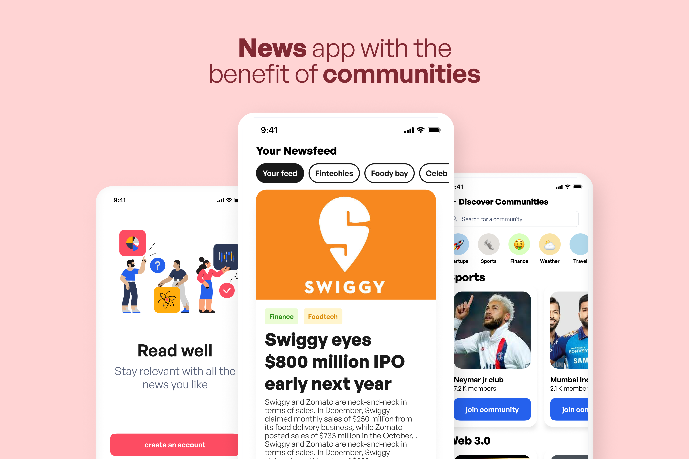

<p align="center">
</a>
</p>

<!-- ALL-CONTRIBUTORS-BADGE:START - Do not remove or modify this section -->
[](#contributors-)
<!-- ALL-CONTRIBUTORS-BADGE:END -->

# InSync

## 📝 Table of Contents
- [Introduction](#introduction)
- [Architecture](#architecture)
- [Technology Stack](#tech_stack)
- [Usage](#usage)
- [Ideology](#ideology)
- [Contributors](#contributors)

<a name="introduction"></a>

## 🐱‍👤 Introduction

News has become quite vague, flashy and not to the point, newsreaders and general users want news in a very crisp and readable format but also don't want to lose the heat and emotions coming from the crowd so that they understand the situation from the ground.

We decided to make a Mobile application to solve this problem

<a name="architecture"></a>

## 🏦 Architecture
<a name="tech_stack"></a>

## 💻📱 Technology Stack
<a name="tech_stack"></a>

- Flutter
  - Dart
- Express.JS
  - Typecript
  - MongoDB
- Heroku
- Postman

### 👷‍♂️ Setup
<a name="usage"></a>

```sh
flutter pub get
```

### 👷‍♂️ Usage

```sh
flutter run
```

### ✨ Format code

```sh
flutter format .
```

### 🧪 Test

```sh
flutter analyze .
flutter test
```
<a name="ideology"></a>
## 💡 Ideology

<a name="contributors"></a>
## 👥 Contributors


## Contributors ✨

Thanks goes to these wonderful people ([emoji key](https://allcontributors.org/docs/en/emoji-key)):

<!-- ALL-CONTRIBUTORS-LIST:START - Do not remove or modify this section -->
<!-- prettier-ignore-start -->
<!-- markdownlint-disable -->
<table>
  <tbody>
    <tr>
      <td align="center"><a href="https://github.com/Manas1820"><br /><sub><b>Manas Gupta</b></sub></a><br /><a href="https://github.com/InSync-HQ/InSync/issues?q=author%3AManas1820" title="Bug reports">🐛</a> <a href="https://github.com/InSync-HQ/InSync/commits?author=Manas1820" title="Code">💻</a> <a href="https://github.com/InSync-HQ/InSync/commits?author=Manas1820" title="Documentation">📖</a></td>
      <td align="center"><a href="https://github.com/hayat-tamboli"><br /><sub><b>Hayat Tamboli</b></sub></a><br /><a href="#design-hayat-tamboli" title="Design">🎨</a> <a href="https://github.com/InSync-HQ/InSync/commits?author=hayat-tamboli" title="Code">💻</a> <a href="#maintenance-hayat-tamboli" title="Maintenance">🚧</a> <a href="https://github.com/InSync-HQ/InSync/commits?author=hayat-tamboli" title="Documentation">📖</a></td>
      <td align="center"><a href="https://github.com/gitgudGR7"><br /><sub><b>N.Raja Vara Siddi Varma</b></sub></a><br /><a href="https://github.com/InSync-HQ/InSync/commits?author=gitgudGR7" title="Code">💻</a></td>
      <td align="center"><a href="https://github.com/keerthi-rajan-s"><br /><sub><b>Keerthi Rajan</b></sub></a><br /><a href="https://github.com/InSync-HQ/InSync/commits?author=keerthi-rajan-s" title="Code">💻</a></td>
    </tr>
  </tbody>
  <tfoot>
    
  </tfoot>
</table>

<!-- markdownlint-restore -->
<!-- prettier-ignore-end -->

<!-- ALL-CONTRIBUTORS-LIST:END -->

This project follows the [all-contributors](https://github.com/all-contributors/all-contributors) specification. Contributions of any kind welcome!
